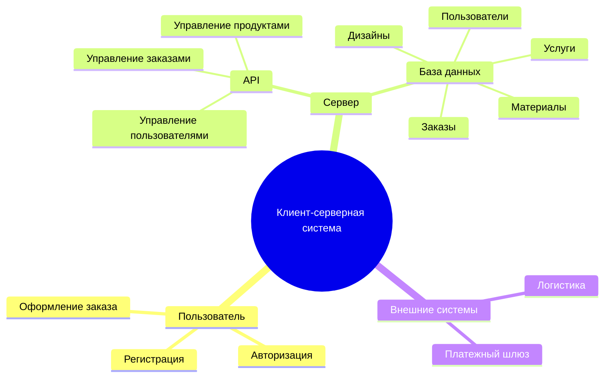
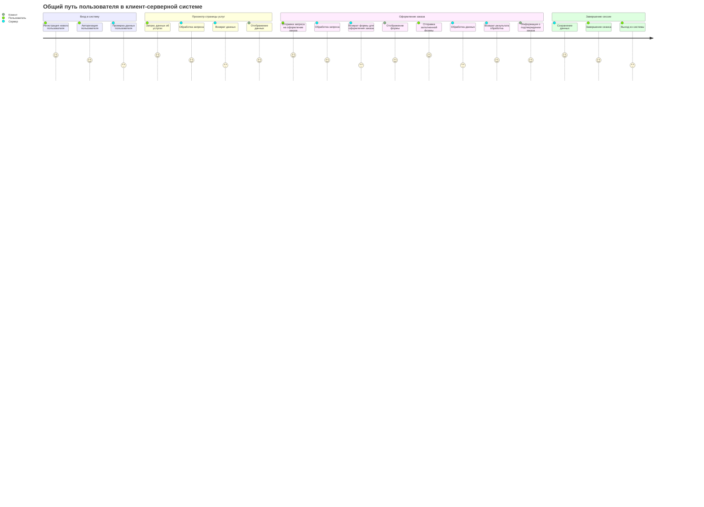
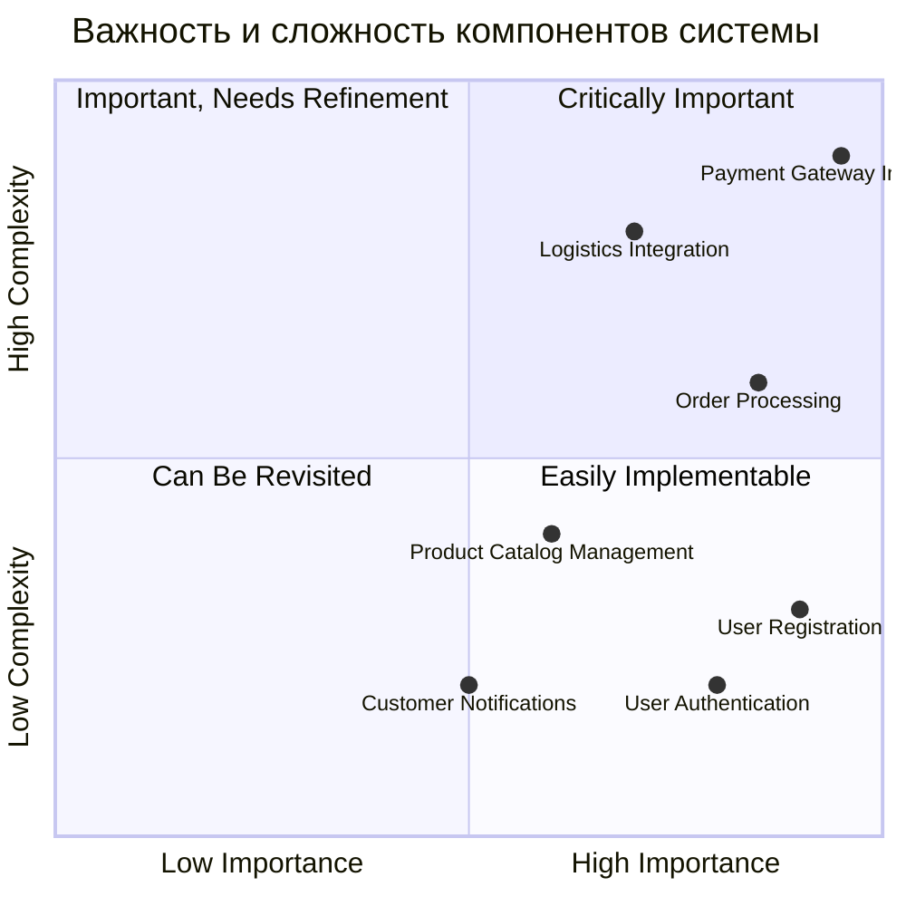
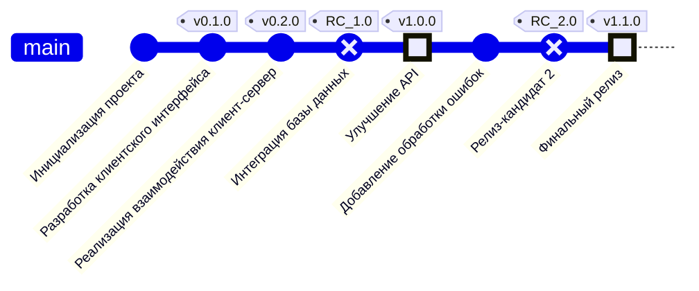

# Клиент-Серверная Система

Этот проект представляет клиент-серверную систему, включая взаимодействие между клиентом, API и сервером.
## Содержание

1. [Структура функциональных возможностей (Mind Map)](#структура-функциональных-возможностей-mind-map)
2. [Диаграмма путешествия пользователя (User Journey Diagram)](#диаграмма-путешествия-пользователя-user-journey-diagram)
3. [Квадрант-граф (Quadrant Chart)](#квадрант-граф-quadrant-chart)
4. [Гит граф (Git Graph)](#гит-граф-git-graph)

---

## Структура функциональных возможностей (Mind Map)

### Пояснение диаграммы
Эта диаграмма в формате mind map отображает общую структуру системы, разделяя ее на три основных аспекта: пользователь, сервер и внешние системы.

1. Пользовательская часть:

  Пользователь взаимодействует с системой через такие функции, как:
  * Регистрация: ввод данных для создания учетной записи.
  * Авторизация: подтверждение своей личности для входа в систему.
  * Оформление заказа: выбор услуг или товаров, создание запроса на выполнение заказа.
  Эти функции обеспечивают базовый пользовательский опыт, позволяя начать работу с системой.
2. Серверная часть:
  
  Сервер состоит из API и базы данных:
  * API:
      + Управление пользователями: обработка данных регистрации, авторизации и обновления профилей.
      + Управление заказами: прием, обработка и хранение информации о заказах.
      + Управление продуктами: предоставление данных о доступных услугах, материалах и дизайнах.
  * База данных:
      + Хранит структурированные данные о пользователях, заказах, предоставляемых услугах, материалах и дизайнах.
3. Внешние системы:
  * Платежный шлюз: обрабатывает транзакции и обеспечивает безопасность платежей.
  * Логистика: отвечает за доставку заказов, включая обработку информации о клиентах и заказах.

Эта диаграмма помогает понять ключевые функциональные элементы системы и их распределение, определяя зоны ответственности каждого компонента.

---

## Диаграмма путешествия пользователя (User Journey Diagram)

### Пояснение диаграммы
Диаграмма User Journey отображает пошаговый процесс взаимодействия пользователя с клиент-серверной системой. Она разбита на несколько логических этапов:

1. Вход в систему:

  * Регистрация: пользователь создает учетную запись, вводя данные, которые сервер сохраняет.
  * Авторизация: пользователь вводит логин и пароль, сервер проверяет данные и предоставляет доступ.
2. Просмотр страницы услуг:

  * Пользователь запрашивает данные об услугах (например, доступные материалы или дизайн).
  * Сервер обрабатывает запрос, возвращает данные, которые затем отображаются на стороне клиента.
3. Оформление заказа:

  * Пользователь выбирает услугу, заполняет форму и отправляет данные на сервер.
  * Сервер обрабатывает данные, сохраняет их в базе, формирует результат и передает информацию клиенту о подтверждении заказа.
4. Завершение сессии:

  * Сервер сохраняет результаты взаимодействия (например, данные заказов).
  * Пользователь завершает сессию и выходит из системы.

Эта диаграмма помогает понять, как пользователь взаимодействует с системой на разных этапах, и отображает, какие действия выполняются сервером и клиентом. Она фокусируется на том, как данные проходят через систему, что важно для проектирования эффективной архитектуры.

---

## Квадрант-граф (Quadrant Chart)

### Пояснение диаграммы
Квадрант-граф оценивает ключевые компоненты системы по двум критериям: важность и сложность. Это помогает определить приоритеты в разработке и планировании ресурсов.

1. Квадрант 1 (Критически важные):

Эти компоненты имеют высокую важность и высокую сложность. Их реализация критична для работы системы, но требует значительных усилий.

  * Интеграция с платежным шлюзом: необходима для обработки оплат, что делает ее ключевой частью системы.
  * Обработка заказов: является основным функционалом, от которого зависит успешная работа всей системы.
2. Квадрант 2 (Важные, требующие доработки):

Компоненты из этого квадранта важны, но их реализация сложна и может быть отложена после критически важных функций.

  * Интеграция с логистикой: сложный процесс, связанный с передачей данных между системами, но крайне важен для выполнения заказов.
3. Квадрант 3 (Могут быть пересмотрены):

Компоненты средней важности и сложности. Их можно пересмотреть или улучшить позже.

  * Управление каталогом продукции: функционал, который можно доработать после реализации базовых функций.
4. Квадрант 4 (Легко реализуемые):

Эти компоненты имеют низкую сложность и высокую важность, поэтому их реализация не требует больших затрат ресурсов.

  * Регистрация пользователей: необходима для работы системы, но легко реализуется.
  * Авторизация пользователей: простой и обязательный компонент для обеспечения безопасности.
  * Уведомления клиентов: дополнительная функция, которая улучшает взаимодействие с пользователем, но не является сложной.

Этот граф помогает расставить приоритеты и определить стратегию разработки системы, начиная с наиболее важных и сложных задач.

---

## Гит граф (Git Graph)

### Пояснение диаграммы
Гит-граф отображает процесс разработки системы с точки зрения управления версиями и этапов реализации. Каждое изменение в коде представлено коммитами, сгруппированными по этапам и помеченными тегами для обозначения значимых версий и релизов.

Этапы разработки:
1. Инициализация проекта:

  * Проект стартует с создания базовой структуры. В этот этап обычно включается настройка репозитория, базовые конфигурации системы и установка окружения разработки.
2. Разработка клиентского интерфейса (v0.1.0):

  * В этом этапе создается веб-интерфейс для пользователей. Это могут быть страницы регистрации, авторизации и оформления заказов. Основной акцент сделан на фронтенд-части системы.
3. Реализация взаимодействия клиент-сервер (v0.2.0):

  * Добавляется взаимодействие между фронтендом и серверной частью через API. На этом этапе серверная логика начинает обрабатывать запросы пользователей.
4. Интеграция базы данных (RC_1.0):

  * Реализуется подключение к базе данных, создание структуры хранения данных (например, таблиц для пользователей, заказов, услуг). Это значительный этап, так как он обеспечивает сохранность и доступ к данным.
5. Улучшение API (v1.0.0):

  * Оптимизация API-сервиса. На этом этапе могут быть добавлены новые эндпоинты, улучшена обработка ошибок или реализована поддержка дополнительных форматов данных.
6. Добавление обработки ошибок:

  * Внедрение механизмов, которые обеспечивают стабильность системы при возникновении исключений или некорректных запросов.
7. Релиз-кандидат 2 (RC_2.0):

  * Тестовая версия системы, готовая к выпуску. На этом этапе проверяются работоспособность всех модулей, интеграция между компонентами и общая стабильность системы.
8. Финальный релиз (v1.1.0):

  * Завершающий этап разработки. Все функции проверены, система готова к использованию в продакшене. Включает в себя итоговые доработки, такие как оптимизация производительности и улучшение пользовательского опыта.

Этапы разработки тесно связаны с функциональными частями системы, описанными в других диаграммах. Например, фронтенд-интерфейс из этапа "Разработка клиентского интерфейса" соответствует пользовательским функциям, показанным в User Journey Diagram.
Теги версий отражают завершение ключевых этапов, что позволяет отслеживать прогресс и вносить изменения на основе обратной связи.
Гит-граф помогает структурировать процесс разработки, разбивая его на логические части, и служит отличным инструментом для документации, особенно при командной работе.
