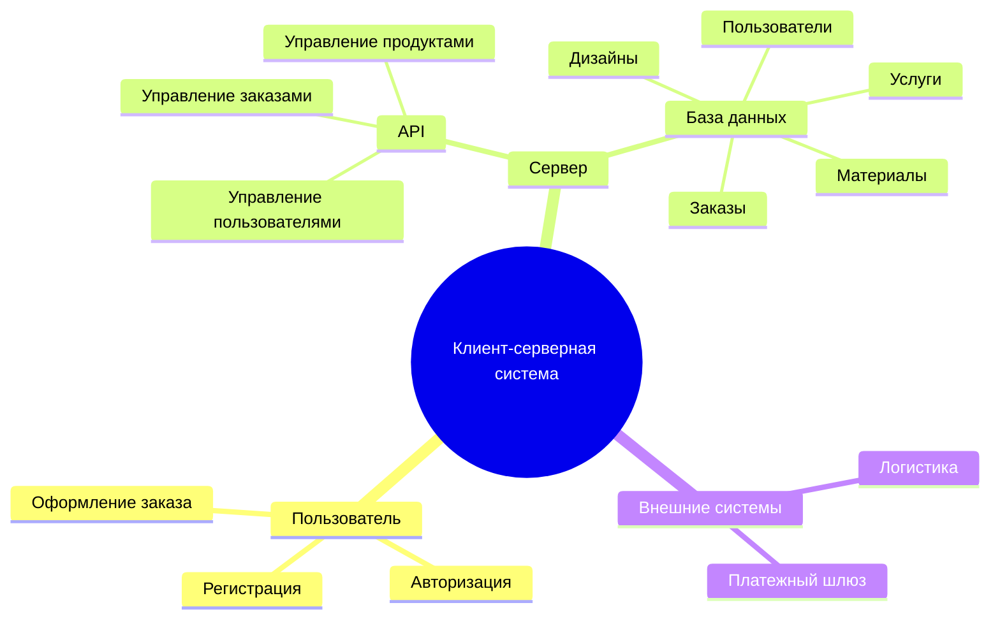

# PKSS
# Клиент-Серверная Система

Этот документ описывает клиент-серверную систему, разработанную на основе файла **"ПКСС_Цветкова"**. Здесь представлены диаграммы, созданные с использованием **Mermaid**, для визуализации ключевых аспектов архитектуры, процессов и разработки системы.

## Содержание

1. [Структура функциональных возможностей (Mind Map)](#структура-функциональных-возможностей-mind-map)
2. [Диаграмма путешествия пользователя (User Journey Diagram)](#диаграмма-путешествия-пользователя-user-journey-diagram)
3. [Квадрант-граф (Quadrant Chart)](#квадрант-граф-quadrant-chart)
4. [Гит граф (Git Graph)](#гит-граф-git-graph)

---

## Структура функциональных возможностей (Mind Map)

### Пояснение диаграммы
Эта диаграмма отображает структуру функциональных возможностей вашей системы:

Пользовательская часть: включает процессы регистрации, авторизации и оформления заказов.
Серверная часть: реализует логику работы через API, управляет пользователями, заказами и услугами. Данные хранятся в базе данных, разделенной на таблицы для пользователей, заказов, услуг, материалов и дизайнов.
Внешние системы: обеспечивают интеграцию с платежным шлюзом для обработки транзакций и логистическими службами для доставки заказов.
